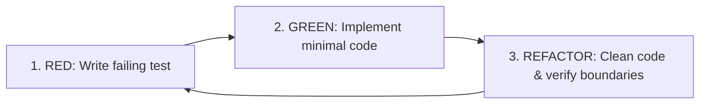

# 06 — Test-Driven Development (TDD) & Quality Assurance

> **Part of AptiTek-02 Architecture Guides**  
> **Master Index:** [ARCHITECTURE.md](file:///home/aptitek/50-59_Code/51_Websites/aptispace-lms-04/ARCHITECTURE.md)

---

## 1. Test-Driven Development (TDD) Workflow

AptiTek-02 follows a strict **TDD Red-Green-Refactor** development cycle for all new utilities, components, and data transforms.



1. **RED:** Write a test asserting the expected behavior, props, theme integration, or edge cases before writing implementation code.
2. **GREEN:** Write the minimal implementation code necessary to make the test pass.
3. **REFACTOR:** Clean up the implementation adhering to SRP, DRY, KISS, and layer boundaries while keeping tests green.

---

## 2. Testing Infrastructure

### 2.1 Vitest 4 with Playwright Browser Mode

Tests execute in a true headless browser environment powered by `@vitest/browser-playwright` and Chromium:

```bash
# Run all unit and component tests
pnpm run test

# Run tests in watch mode
pnpm run test:watch
```

### 2.2 Storybook 10 Component Workbench & A11y Gate

Every new atom, molecule, and organism must have a corresponding `.stories.tsx` file verifying:

1. **Light & Dark Solarized Theme rendering.**
2. **Interactive States (hover, focus, disabled, active).**
3. **Accessibility Compliance:** Automated audit via `@storybook/addon-a11y` (zero WCAG AA violations allowed).

```bash
# Start Storybook development server
pnpm run storybook

# Build Storybook static artifacts & run test suite
pnpm run build-storybook
```

---

## 3. Storybook Canonical Story Pattern

```tsx
import type { Meta, StoryObj } from "@storybook/react-vite";
import { ExpressiveCard } from "~/components/atoms/ExpressiveCard";

const meta: Meta<typeof ExpressiveCard> = {
  title: "Atoms/ExpressiveCard",
  component: ExpressiveCard,
  parameters: {
    layout: "centered",
  },
  tags: ["autodocs"],
};

export default meta;
type Story = StoryObj<typeof ExpressiveCard>;

export const Default: Story = {
  args: {
    $variant: "standard",
    $interactive: true,
    children: <div>Interactive Card Content</div>,
  },
};

export const HolographicVariant: Story = {
  args: {
    $variant: "holographic",
    $interactive: true,
    children: <div>Holographic Course Pass</div>,
  },
};
```

---

## 4. Vitest Strict Lint Rules

Configured in `eslint.config.js`:

- `vitest/no-focused-tests`: `error` (disallows committed `fit` / `it.only`).
- `vitest/no-disabled-tests`: `warn` (flags forgotten `xit` / `it.skip`).
- `vitest/expect-expect`: `error` (ensures every test contains assertions).
- `vitest/no-identical-title`: `error` (prevents duplicated test descriptions).
